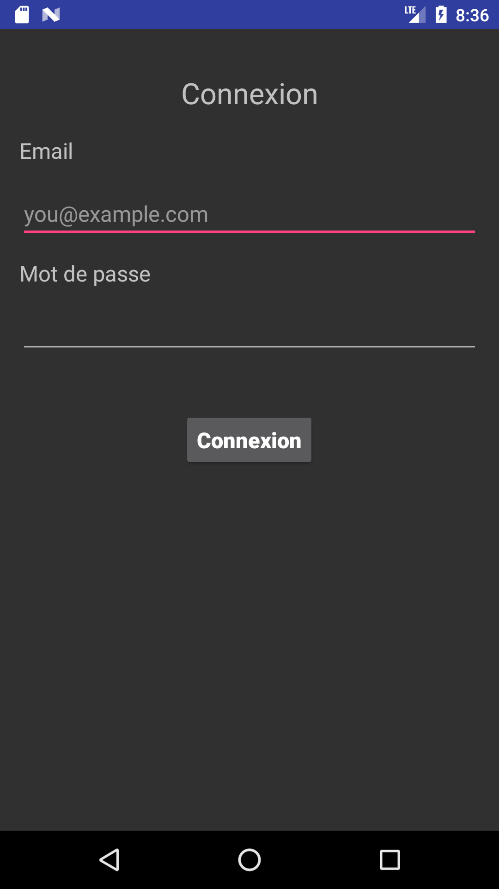

# Descriptions de l’application 
Speed est une application qui a été développée dans le cadre d'un mémoire de sortie.
Elle utilise Firebase pour permettre une mise à jour en temps réel des données collectées sur le traffic routier.

## Structure des données.
Les informations recueillies par l’application sont stockées au format GeoJSON.

La liste des variables obtenues par l’application sont  :

### Trajet
Informations concernant le trajet observé.

|Nom de la variable | Définition |
| :---------------- | :--------- |
|Identification_trajet | Identification unique du trajet dans la base|
|Identification_chauf | Identification unique du chauffeur|
|Identification_enq|Identification unique enqueteur|
|Ligne_trajet|Ligne du trajet|
|Prix_fixe|Prix fixé par personne par trajet|
|Sens_trajet|Sens du trajet(aller ou retour)|
|Temps_charg|Temps mis pour un chargement complet|
|Capacite_vehi|Capacite du vehicule|
|Type_vehi|Type de vehicules|
|Heure_dep | Heure du depart|
|Coord_dep | Coordonnees GPS du point de depart|
|Nbre_persD| Nombre de personnes au depart|
|Heure_arv |Heure de l’arrivee|
|Coord_ arv| Coordonnees GPS du point d’arrivee|
|Nbre_persArv| Nombre de personnes  a l’arrivee|

### Lignes de contrôle
Sont des subdivisions du trajet en des distances de 20 mètres. 
Pour chaque ligne de contrôle, le temps mis pour le parcourir et les coordonnées GPS des deux extrémités de la ligne sont enregistrées.

|Nom de la variable | Définition |
| :---------------- | :--------- |
|Identification_trajet | Identification unique du trajet dans la base |
|Heure_debut |coordonnées GPS du debut de ligne|
|Heure_fin | Coordonnees GPS de la fin de ligne |

### Arret
Les arrets effectués durant un trajet

|Nom de la variable | Définition |
| :---------------- | :--------- |
|Identification_trajet | Identification unique du trajet dans la base|
|Heure_debut | Heure de l’arret |
| Coord_arr | Coordonnees GPS du point d’arret|
| Pers_Des | Nombre de personnes qui descendent a l’arret |
|Pers_Mon | Nombre de personnes qui montent à l’arrêt| 
|Heure_fin  |Duree de l’arret|

